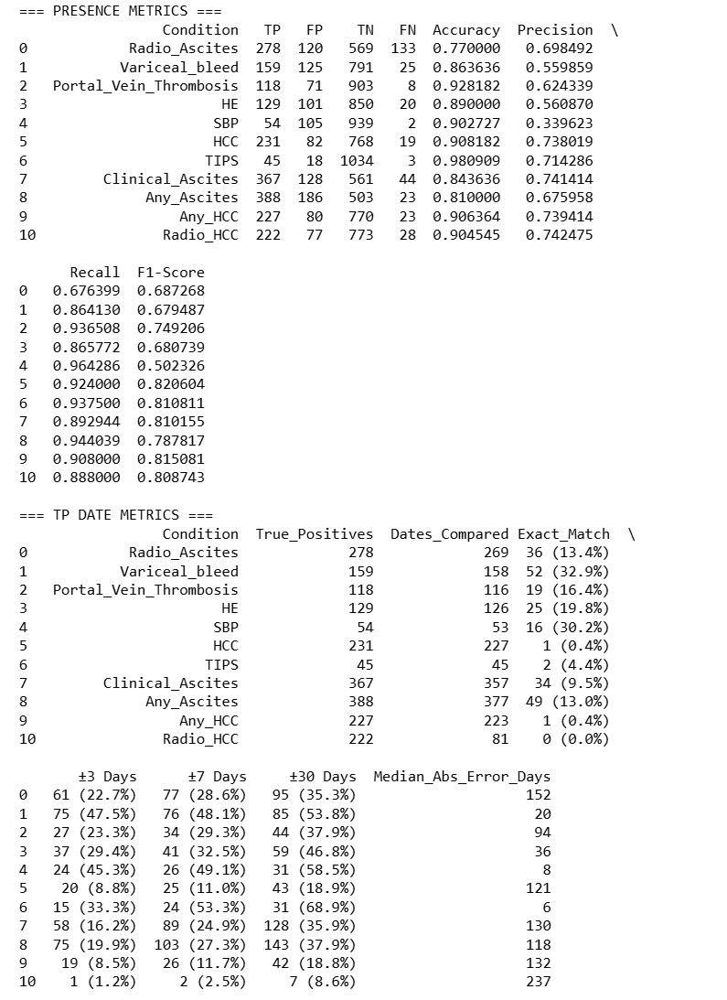

# Singhealth-Hepatic-Decomposition-Classification
# Project Documentation

## Table of Contents

* [Notebooks](#target-notebooks)
* [1. Purpose and Scope](#target-1-purpose-and-scope)
    * [1.1 Purpose](#target-11-purpose)
    * [1.2 Inputs and Outputs](#target-12-inputs-and-outputs)
    * [1.3 Scope](#target-13-scope)
* [2. Prerequisites and Environment Setup](#target-2-prerequisites-and-environment-setup)
    * [2.1 Local LLM Tools](#target-21-local-llm-tools)
    * [2.2 Tech Stack](#target-22-tech-stack)
    * [2.3 Ollama Information](#target-23-ollama-information)
    * [2.4 Python Libraries](#target-24-python-libraries)
* [3. Architecture Overview](#target-3-architecture-overview)
* [4. Continual Maintenance and Tuning Guide](#target-4-continual-maintenance-and-tuning-guide)
    * [4.1 How to Edit the Pipeline](#target-41-how-to-edit-the-pipeline)
    * [4.2 How to Adjust the Pipeline Based on Results](#target-42-how-to-adjust-the-pipeline-based-on-results)
* [5. Data and Results](#target-5-data-and-results)
    * [5.1 Exploratory Analysis of Data](#target-51-exploratory-analysis-of-data)
    * [5.2 Optimisation Philosophy](#target-52-optimisation-philosophy)
    * [5.3 Results](#target-53-results)
* [6. Recommendations for Systemic Improvement and Core Challenges](#target-6-recommendations-for-systemic-improvement-and-core-challenges)

<a id="target-notebooks"></a>
# Notebooks

All necessary notebooks in order of run

### Data Cleaning
Input: raw excel hepatic decomposition event sources\
Output: cleaned sources\
Cleans the raw data 

[pre-LLM](./pre-LLM_clean.ipynb)

### Main Heuristic and LLM
Input: cleaned sources\
Output: structured output of hepatic decomposition event true or false\
Main function for heuristic that gives us our snippet and LLM

[LLM](./LLM.ipynb)

### Evaluation of pipeline's results
Input: structured output of hepatic decomposition event classified as true or false per patient\
Output: optimistaion metric results\

[evaluation](./Evaluation.ipynb)

### Other Utility Functions
[Utilities](./Utilities.ipynb)

<a id="target-1-purpose-and-scope"></a>
# 1. Purpose and Scope
<a id="target-11-purpose"></a>
## 1.1 Purpose
The following pipieline is developed to automate the binary extraction of structured data of hepatic decomposition events from unstructured clinical notes.
<a id="target-12-inputs-and-outputs"></a>
## 1.2 Inputs and Outputs
Input; example of clinical note:
```
 .....History HCC surveillance FINDINGS ULTRASOUND ABDOMEN Previous ultrasound: No Liver - Hepatomegaly - Echogenicity: Normal - Echotexture: Mildly coarse - Contour: Mildly irregular - No suspicious solid focal lesion. - Cysts: Nil Portal Vein - Normal hepatopetal flow Biliary ducts - Not dilated. Common duct diameter: 0.4 cm Gallbladder - Normal Right Kidney - Normal. 11.6 cm Left Kidney - Normal. 10.9 cm Spleen - Enlarged. 27.1 cm Pancreas - Visualised portion normal. Tail obscured. Others - Splenorenal shunt and recanalization of paraumbilical vein noted. CONCLUSION 1. Enlarged liver with mildly coarse echo texture and mildly irregular superior margin.Cirrhosis is likely diagnosis. 2. There are signs of portal hypertension, viz, ....
```
Output:\
excel csv of `Random ID`, `event_presence` and `event_date` (result)
```
Random ID| HCC_presence | HCC_date |
  XXXXX  | :--- | :--- |
  XXXXX  | True | 2026-03-14 |
  XXXXX  | False | *None* |
  XXXXX  | True | 2026-01-20 |
  XXXXX  | True | 2025-11-02 |

```
excel csv of `Random ID`, `category`,`decision`,`rationale` and `snippet` (for debug)
```
Random ID| category | decision | rationale |snippet |
  XXXXX  | :--- | :--- | :--- | :--- |
  XXXXX  | HCC | 1 | "Documented active status with insulin script." | "Patient presents for management of ..."|
  XXXXX  | HCC | 0 | "Condition noted but missing clear active assessment." | "History of CHF, ejectio.."|
  XXXXX  | HCC | 1 | "Clear diagnostic link with current treatment." | "Exacerbation of chronic obstructive pu..." |
  XXXXX  | HCC | 0 | "Date of diagnosis conflicts with laboratory data timeline." | "Stage 4 rena.." |
```

## 1.3 Scope
Main sources: General Lab, Discharge Summary, Outpatient Summary, Imaging Reports, Endoscopy Reports

<a id="target-2-prerequisites-and-environment-setup"></a>
# 2. Prerequisites and Environment Setup
<a id="target-21-local-llm-tools"></a>
## 2.1 Local LLM Tools
when choosing the the tool for local LLM, some options include HuggingFace, Ollama, LM studio, vLLM.

### Why Ollama
Ollama is arguably one of the easiest and most popular ways to run llms for now. It's pros is its balance between being a user friendly interface(Ollama app) and technical tool for developers (running by jupyter notebook/machine). In the app version, Ollama handles all the RAM allocation, model quantization etc. work for you in the background. While in the developer version, you can engineer and specify RAN allocation, temperature, seed parameters to optimise the llm. 

### Alternatives
Another alternative I considered was HuggingFace, it is only developer/engineer focused, giving more control to fine tuning, but little user friendliness. HuggingFace also allows you to train models, which means you could train a model just for reading the hepatic decomposition notes. You can also further train models from exisitng models, meaning you dont have to create models from scratch. This however, requires more computational power. HuggingFace also has a much larger library of models, with its own open community of people contributing model they've trained/refined. 

I initially wanted to give it a try, but I encountered difficulties with the IT when trying to download HuggingFace. I had to download HuggingFace through cmd which they placed a lot of restrictions on (it was basically as good as downlading software off the internet which they dont allow me to) 

### IT Status (as of when I left)
Initially in earlier part of my internship, they allowed me to download ollama and also the models on ollama, as long as the IT person was there to watch. They had to take down security barriers for the models to be downloaded.

However, the next time i called them over, they said they updated their IT protocols and can no longer take down the security barriers to download anything. So while I wanted to try a model with more parameters (smarter) 7-9B, I did not manage to do so because of the IT. 

<a id="target-22-tech-stack"></a>
## 2.2 Tech Stack
### Software
- jupyter notebook (alternative: VS code with jupyter notebook extension)
- ollama 


### Hardware
- requires minimum 12.0+ CUDA version on NVIDIA GPU to run layers on GPU \
(optional but recommended, by default all layers run on CPU, so it runs much faster when offsetting layers from CPU to GPU)


### Model
- qwen3:4b

<a id="target-23-ollama-information"></a>
## 2.3 Ollama Information
user friendly interface(Ollama app) and technical tool for developers (running by jupyter notebook/machine)

### Commands
Relevant commands to run for Ollama (on windows cmd, if it doesnt work then try anaconda prompt)
- 'ollama list'
    - gets all the available models downloaded in Ollama right now
- 'ollama pull `model name`'
    - download model `model name`

### Pull/ Download Models
1. Go into the Ollama App and select the model and try to chat on it (it will auto download)\
    if the model cannot be found then search directly on the models list in the app
2. OR go to Anaconda Prompt and do 'Ollama pull `model name`'

Full list of models you can get on ollama:\
https://ollama.com/library

### Running 
1. Open jupyter notebook and the .ipynb file 
2. press Run button at the top to run code in each cell
3. jupyter runs sequentially by cells, to run everything at once click 'cell', 'run all'

<a id="target-24-python-libraries"></a>
## 2.4 Python Libraries
[requirements.txt](./requirements.txt)

1. go into anaconda prompt
2. navigate to folder containing requirements.txt
3. run `pip install -r requirements.txt`

pydantic: data validation library that forces python code to strictly obey to rules set for data types (like output integers only, or string, lists etc.)

<a id="target-3-architecture-overview"></a>
# 3. Architecture Overview
There are multiple layers to the pipeline explained below, the 2 main tiers being 
1. Classical python layer: rule based python (regex, keyword mapping, sentence tokenization) to chop up chunks of clinical texts to snippets
2. Generative llm layer: Pass snippets into llm. Pydantic schema helps the neural network handle messy and subjective outputs from the llm.

A multi layered pipeline addresses the following issues of the hepatic extraction problem:

- long texts - limited llm tokens will result in many iterative runs to finish for a single patient
- limited computational power - feeding the full long text on many iterative runs will require a lot of computational power, or otherwise, take a long time

<a id="target-4-continual-maintenance-and-tuning-guide"></a>
# 4. Continual Maintainence and Tuning Guide
## 4.1 How to edit the pipeline
### Including New Snippets and Keywords
Variables: `KEYWORD_MAP`\
Snippets are selected only if they contain at least 1 keyword under the keyword map for each respective label. Earlier keywords in the list of each label has a higher priority to be selected.

You may also use regular expressions (regex) rather than just a string of word
```python
r"(?<!secondary )peritonitis"
```

Overly specific keywords will give high FNs, while overly vague keywords will give high FPs


### Including Case Sensitive Keywords
Variables: `CASE_SENSITIVE_KEYWORDS`\
To list specific keywords in the keyword map that has to be found in a certain form. For example, `'HE'` must be capital because 'he' would have an entirely different meaning from 'HE' as hepatic encephalopathy.

### Writing Prompts 
Variables: `CATEGORY_PROMPTS`\
Prompt for the llm. For 4B models, writing overly complex or long prompts easily cause hallucination. Llms are particularly sensitive to prompting and its better to acheive garunteed results from adjusting other parts than the prompt. To reduce the length of prompt and confusion per label, i have seperated prompts to per label. The llm deduces negative or positive label by label - when looking at all 7 labels, it will look one by one at each label and its prompt to dedeuce the deicision.

### Second layer of Snippet refinement/filter
Function: `the_bouncer_score`\
A second layer of heuristic that goes into detail of each snippet more by giving or removing points from each snippet. Here u can add specific targetted keywords for:

- edge cases
- negations (no, not etc,)
- positive words (yes, y ,present)

Adding points incentivise while minusing points punish. Total points of each snippet are collated at the end. Snippets with higher points are prioritised first when selecting snippets to send to the llm.

** This is useful for keywords that will appear in the snippet along with the condition but no garuteed to be a specific order, for example: 'portal vein thrombosis', 'thrombosis in pv', 'main pv thrombosis', there are many ways to say PVT. Implementing a heuristic for the PVT will help handle these types of situations.
```python
if category == "Portal_Vein_Thrombosis":
        if any(word in text_lower for word in ["thrombosis", "thrombus", "clot", "thrombosed", "occluded"]):
            score += 1000
        if any(word in text_lower for word in ["vein", "vin", "venous"]):
            score += 500
        if any(word in text_lower for word in ["portal vein", "pv"]):
            score += 800
        if any(word in text_lower for word in ["splenic", "smv"]):
            score += 900
        if re.search(r"\bportal hypertension\b", text_lower):
            score -= 2000
        if re.search(r"\bnormal\w*\b", text_lower):
            score -= 200
        if re.search(r"\bpatent\b", text_lower):
            score -= 200
        if re.search(r"\bhepatopetal flow\b", text_lower):
            score -= 200
 ```

### Negation 
Function: `is_negated`\
Similar to `the_bouncer_score` but any snippet found with negations are completely removed from the snippet list rather than just punished in points (when punish in points it will just move further back in the list and be evaluated later) 

I set specific negation rules for each label, derieved from experimentation.\
In general you should mainly edit these parts:

`neg_pattern` the list of negation words
```python
        neg_pattern = r"(no|suggestive of.............for|nil|differential)"
```

`10` is the distance of the negation word from the keyword found in the snippet. Here, if any of the negation words are found 10 characters before the keyword of the snippet, the snippet will be removed from the snippet list.

```python
if re.search(fr"{neg_pattern}.{{0,10}}\b{safe_kw}\b", lower_snip):
                return True
```
### * Sorting of Snippet List
Function: `extract_neighborhoods`\
Snippets are stored as tuple: (snippet_score, snippet_text, snippet_date)

The pipeline is sorted in priority of descending score, followed by ascending date, and then the original order of the tuples in the list before sorting (which is actually by order of keywords in the keyword map)

This ensures highest score snippets show up first, followed by earlier date snippets (because we're trying to find earliest date of each hepatic condition) and then lastly by keyword priority.

To swap descending to ascending or vice versa, just add a minus infront. 

```python
scored_snippets.sort(key=lambda x: (-x[0],x[2]))
```
### Changing Formula for Splitting Text to Snippets
Function: `extract_neighborhoods`\
Splitting of raw texts to snippets are done with regular expressions(Regex).

The following Regex splits a block of text into individual sentences and clean text fragments.\
It breaks the text apart whenever it encounters:

- Spaces after sentences (ending in ., !, or ?), while keeping the punctuation attached to the sentence
- Line breaks (\n)
- Semicolons (;)
- Pipe characters (|)

```python
raw_sentences = [s.strip() for s in re.split(r'(?<=[.!?])\s+|\n+|;\s*|\|\s*', text) if s.strip()]
```

### Change Snippets per patient selected for Evaluation
Function: `extract_neighborhoods`\
Top `3` snippets out of all the snippets for eah patient selected to be sent to llm for evaluation. Time taken to determine whether each hepatic event is positive or negative for each patient will take longer if it's increased. 

```python
final_output[:3]
```

### Immediate Categarisable Labels
This feature is mainly targetted at discharge summaries or outpatient summaries where they will write smth like 'HCC: y', 'HCC: -present" etc. Again, `case_sensitive_cats` is for categories that must be written in a specific form - 'HE' must be capital and cannot be 'he'. 

```python
    case_sensitive_cats = ['HE']
    case_insensitive_cats = ['HCC','Hepatocellular carcinoma', "hepatic encephalopathy","Ascites", "PVT", "portal vein thrombosis", "SBP","Variceal Bleed","variceal haemorrhage",'Spontaneous Bacterial Peritonitis']

    affirmative_pattern = r"\s*[-.]?\s*(?:y|yes|present)\b"

    if category in case_sensitive_cats:
        # Strict category label, but flexible affirmative word
        if re.search(rf"{category}:\s*{affirmative_pattern}\b", snippet, re.IGNORECASE):
            # Double check: ensure the category itself is actually uppercase
            if f"{category}:" in snippet:
                print(f"[{category}] ID: {patient_id} - Immediate Match (Strict): 1")
                return 1
    elif category in case_insensitive_cats:
        # Flexible label and flexible affirmative word
        if re.search(rf"{category}:\s*{affirmative_pattern}\b", snippet, re.IGNORECASE):
            print(f"[{category}] ID: {patient_id} - Immediate Match (Relaxed): 1")
            return 1
        
```

### Adjusting Local LLM Parameters
Function: `evaluate_snippet`

`temperature`: controls how predictable or creative the model's responses are. It scales from 0.0 to 2.0\
`num_ctx`: sets the maximum number of tokens (words/characters) the model can remember during a single conversation session\
`seed`: an integer number used to initialise the model's random number generator. When u run on the same seed, the result will always be the same gievn the same code - its consistency is used for sample testing.\
`num_gpu`: number of layers offset to GPU from CPU\
    increase to run llm faster, but make sure temperature of GPU never goes above 80 degrees celcius because it will start throttling
    
### Adjusting Sources for each Label
Function: `process_patient_sniper`

Target testing sources to only relevant ones to prevent hallucination and capturing irrelevant snippets.

Clinical Ascites: Discharge & Outpatient summary\
HE: Discharge & Outpatient summary\
HCC: Discharge & Outpatient summary\
SBP: Discharge & Outpatient summary\
Radio Ascites: Imaging report\
Variceal Bleed: Discharge & Outpatient summary, Endoscopy report\
PVT: Discharge & Outpatient summary, Imaging report


```python 
if category in ["Clinical_Ascites", 'HE', 'HCC', 'Spontaneous_Bacterial_Peritonitis']:
            raw_text = f"DISCHARGE: {row.get('Discharge_Entry', '')}\nOUTPATIENT: {row.get('Outpatient_Entry', '')}"
        elif category in ['Radio_Ascites','Portal_Vein_Thrombosis_presence']: 
            raw_text = f"IMG: {row.get('Img_Entry', '')}"
        elif category=='Variceal_Bleed':
            raw_text = f"DISCHARGE: {row.get('Discharge_Entry', '')}\nOUTPATIENT: {row.get('Outpatient_Entry', '')}\nENDOSCOPY: {row.get('Endo_Entry', '')}"
        else:
            raw_text = f"IMG: {row.get('Img_Entry', '')}\nDISCHARGE: {row.get('Discharge_Entry', '')}\nOUTPATIENT: {row.get('Outpatient_Entry', '')}"
```

### Interval Saves
Function: `run_sniper_test`

Saves results every `5` samples evaluated to csv `file_name`

```python
 if len(results) > 0 and len(results) % 5 == 0:
                pd.DataFrame(results).to_csv(file_name, index=False)
```
### Asynchronous Run
Variables: `CONCURRENCY_LIMIT`\
`CONCURRENCY_LIMIT` represents the maximum number of concurrent tasks that can occur simultaneously in the system\
**I removed it after/ set to 1 because I am not sure if running asynch is causing the pipieline to mismatch samples to their decisions**

### Changing the LLM Model
Variables: `MODEL_NAME`\
When changing the model name, you have to type the exact same model name as what you see on the ollama app itself, or when u run `ollama list` to check what models are available.

### Selecting Categories to Run
Variables: `selected_categories`\
`selected_categories` is the categories you select to run each time. This is mostly for testing purposes so I don't have to run all 7 labels each time.

<a id="target-42-how-to-adjust-the-pipeline-based-on-results"></a>
## 4.2 How to Adjust the pipeline based on Results
The best way to refine the pipeline is to look through the rationale csv and look at the snippets generated for each sample, as wel as the rationale for the llm's decision

Generally decreasing FNs is harder than FPs because there are more positives in hepatic decomposition events than negatives. 


### High FPs
High false positives means the heuristic criteria to determine positives is too vague.\
This could be several cases:

- keyword too vague or too general for determining the hepatic event. In some cases, the keyword can be also something mentioned in the preventive stage of the heaptic event, hence, not being a perfectly good indicator of positives.
- `is_negated` or `the_bouncer_score` is not strict enough. When this happens, there is too many rubbish snippets at the front of the snippet list and when selecting the top `3` to the llm, they are likely rubbish snippets.
- Adjusting more conditions to the prompt

### High FNs
High false negatives means the heuristic criteria to determine positives is too strict.\
This could be several cases:

- keyword is too specific\
    if its difficult to make it less specific, for example a phrase like 'portal vein thrombosis' you should break the word into parts, 'thrombosis' would be the most important part of the phrase. As for 'portal' and 'vein' since they're very vague words, you can make use of `the_bouncer_score` to simply incentivise for appearing in snippets rather than introducing as standalone keywords.
- negation too strong and removing even the important snippets. Remove the negation word in the list causing this OR reduce the number of characters before/after the keyword found in `is_negated`
- number of snippets selected to send to llm could be too small `extract_neighborhoods`
- Adjusting more conditions to the prompt
- Misspelt words in the clinical notes, making the pipeline unable to catch some keywords. One example is `PVT` "vein", and "vin"


### Adjusting the Prompt
Whenever the prompt is adjusted the response from the llm is very volatile and unpredictable. You should avoid adjusting the prompt as much as possible and adjust the heuristic instead because adjusting the prompt to work will take much longer - the llm is a black box and there is no way to understand how it came to the conclusion of a postive/negative other than looking at the rationale they gave.

### Samples Running for too long or stuck
In the event the llm gets stuck or slows down, on the bottom right of windows, click the up arrow, right click the ollama logo and press quit ollama. Then reboot back ollama by opening the ollama app.

It could also be that you're sending snippets per sample to the llm. (`extract_neighborhoods`)

<a id="target-5-data-and-results"></a>
# 5. Data and Results
<a id="target-51-exploratory-analysis-of-data"></a>
## 5.1 Exploratory Analysis of Data

**Total Random IDs in Source of Truth is 1203, because some Random IDs had NA for all the above sources, Total actual number of Random IDs we can look at is 1100, thus, Total samples= 1100**

```python
                      Count_0  Count_1  Total_Samples
Ascites (Y/N)             689      411           1100
Variceal bleed (Y/N)      916      184           1100
HE (Y/N)                  951      149           1100
SBP (Y/N)                1044       56           1100
HCC (Y/N)                 850      250           1100
PVT (Y/N)                 974      126           1100
TIPS (Y/N)               1052       48           1100
```
<a id="target-52-optimisation-philosophy"></a>
## 5.2 Optimisation Philsophy
As seen, number of negatives is much higher than positives. This makes decreasing FNs is harder than FPs because there are more positives in hepatic decomposition events than negatives. Considering this precision-recall trade off, low FNs would be easier to achieve than low FPs, in other words, prioritise on recall over precision.

Moreover, in the context of clinical diagnosis, prioritising to look for positive patients over negative patients for hepatic events is also a logical standpoint.

A likely extension of the solution is to have clinicians still look at clinical notes to manually give hepatic event diagnosis, but only read the positive ones which are generally lesser as we already know. This will still serve as a solution for the problem statement given.

<a id="target-53-results"></a>
## 5.3 Results
### Speed
The more positives a patient has, the longer it takes to finish running per patient\
~ 5-6 minutes per sample, all 7 labels (takes into consideration that its unlikely a patient has all positives for all labels, as that would be the max time)\
~ 3.685 days for all 1100 samples
### Metrics and  Earliest Date of each Event
Radio_Ascites and Radio_HCC can be ignored (they are seperate labels based on ONLY radiology report that I included for prof)

<br clear="left">

### Additional Labels
#### Any Ascites
Any_Ascites_presence==1 when either Clinical or Radio Ascites is 1

#### Any HCC
Any_HCC_presence==1 when either (Clinical) HCC or Radio HCC is 1

<a id="target-6-recommendations-for-systemic-improvement-and-core-challenges"></a>
# 6. Recommendations for Systemic Improvement & Core Challenges

## Model Upgrade
The most immediate upgrade I would recommend is to upgrade the model to Qwen3:8b, which you'll have to download first

## Experimentation to find the Best Model
There are many Ollama models available to download off, as they have an open community where anyone can upload the models they trained. Plus with the rapid advancement of AI, I believe there will be a better llm model out there for the problem. (Only issue is that you have to look for the IT everytime you want a llm model downloaded)

## Hardware Upgrades
The result achieved is highly constrained by standard workstation hardware (PC). To scale the solution across large datasets or use more powerful, higher parameter llms, future investments should be directed towards dedictaed on-premie AI hardware. The most strategic future improvement would be to involve collaboating with national health-tech entities to access secure AI computing bases, this will be something like Chatgpt which is a cloud web AI, but one just for the organisation's use.

For context, the PC right now:

- CPU: Intel Xeon w3-2423 (6 cores, 12 logical processors)
- 64GB RAM
- Windows 11
- GPU: NVIDIA T1000 8GB VRAM

max speed limit: 7B to 9B parameters

Recommended max speed limit for AI workstations: 14B to 32B

- GPU 16-24VRAM (NVIDIA RTX 3090 or higher)
- 16 - 24+ core
- 64GB to 128GB DDR5 RAM

Upgrading is important as it'll rpovide more computational power to run better models that produce better results, process samples quicker, and use more tokens (run more words each time).

There are also other alternatives instead of upgrading hardware, like combining the computational power of many different computers into one massive supercomputer to run local llm - vLLM + Ray. Though I would likely think it violates singhealth's IT policies.

## Standardised Documentation and Active Collaboration
From the project I realised that a lot of the medical knowledge was very difficult to navigate, given I don't have the background to do so. Having the collaborative effort for all the stakeholders or clinicians that are the one manually looking through this clinical notes to create a standard documentation to classify these hepatic events would have been very helpful. Added with being able to actively collaborate and ask them questions would make the pipeline much more accurate.

## Medical LLMs
Initially the idea of using a medical llm came to mind, but the main issue was that medical llms perform very poorly in returning structured outputs like json or a specific structure. After considering the tradeoffs, I did not end up further exploring or trying medical llms. 

A possible solution is to try medical llms with pydantic as it may help the llm give an accurate structured output, or to have medical llms first look at the clinical notes and summarise the hepatic events for a general llm to do the outputing.

## Outliers
There was also many strange outliers in the dataset. Example, the source of truth is positive `HCC` but no information indicating positive `HCC` was found in any of the clinical notes I was looking at. It is possible that there are missing clinical notes where the important part of the information is stored, which I believe having the help of clinicians to understand why would be good.

## Natural Challenge of Clinical Notes
Each patient has a lot of clinical notes. Cloud web AI like PairChat is much more powerful than the local llms we can run on a single PC, because theyre backed by a supercomputer through a server and has a much more tokens for higher contextual memory. However, even PairChat is not the perfect solution to the problem, since the clinical notes of patients is still to lengthy to fit in the context window limit (context overflow)

Hence, there has to be some way to extract important parts of these clinical notes to feed the llm, rather than dumping the entire thing there. While in my case I used a heuristic to extract the relevant snippets from clinical notes, there are other solutions too. One of the other solutions I considered was Vector Search with RAG.

Heuristic Solution:\
pros:

- highly predictable and transparent (the entire algorithm can be observed)
- very auditable

cons: 

- tedious to fine tune
- requires a lot of human intervention (updating keywords etc.)

Vector Search:\
pros: 

- little human intervetion
- more scalable
- faster to get off the ground at the start

cons:

- little transparency- black box
- very mathematical and hard to fine tune


Incomplete but basic code of VectorSearch RAG solution (need to download libraries):\
[Vector Search and RAG](./VectorSearch_RAG.ipynb)
